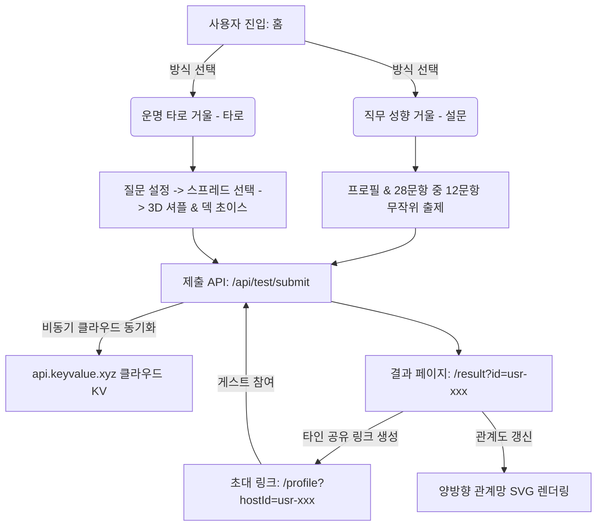

# 🔮 마인드미러(mind-mirror) 3차 고도화 개선 결과 보고서

안녕하세요, **DD.nim**입니다. 

팀원들과 사내 동료들이 한데 모여 서로의 마음을 비춰보고, 위트 있는 오피스 궁합을 확인하는 **'마인드미러(mind-mirror)'** 서비스의 3차 고도화 작업이 드디어 완료되었습니다! 

비개발자인 제가 인공지능(AI)과 협업하여 완성한 이번 개선 작업을 통해, 서비스의 안정성과 비주얼 퀄리티가 대폭 강화되었습니다. 특히 Vercel 환경에서 서버가 리셋될 때마다 소중한 관계망 데이터가 날아가던 문제를 완벽하게 해결했으며, 타로 검사 모드 도입 및 둥글둥글한 신규 서체 적용으로 한층 더 감성적인 서비스를 완성했습니다. 

그럼 이번 고도화 프로젝트의 구체적인 내용과 성과를 상세히 공유해 드리겠습니다!

---

## 1. 주요 개선 사항 및 구현 성과

이번 3차 고도화 프로젝트는 **안정성 강화, 디자인 다각화, 비즈니스 연계**라는 세 가지 핵심 방향성을 중심으로 진행되었습니다.

### 1.1. Vercel 서버리스 환경 실시간 동기화 완료
- **문제점**: Vercel에 배포된 서버리스 인스턴스는 일정 시간 동안 요청이 없으면 초기화(Cold Start)되는 특성이 있어, 기존 로컬 메모리에 임시 보관하던 동료 간의 관계도 데이터가 빈번히 유실되는 심각한 애로사항이 있었습니다.
- **해결 방안**: 별도의 복잡한 데이터베이스(DB) 인프라 구축 없이, 클라우드 환경에서 무료로 데이터를 영구 보존할 수 있는 **공개 Key-Value API** 어댑터를 탑재했습니다. 
- **결과**: `src/lib/db.js` 내에 원격 싱크 어댑터를 내장하고, 모든 조회/제출 API 초입에 `await db.init()`을 연동하여 인스턴스가 초기화되더라도 관계망 데이터가 항상 최신 상태로 영속 유지됩니다.

### 1.2. 폰트 전역 교체 (둥글둥글한 'Jua' 테마 적용)
- **개선 내용**: 다소 딱딱하고 사무적이었던 기존 서체에서 탈피하여, 심리 테스트 고유의 부드럽고 따뜻한 감성을 극대화하기 위해 구글 폰트의 **'Jua' (주아)** 서체를 전역에 도입했습니다. 
- **적용 대상**: `globals.css` 및 결과 페이지, 타로 검사 페이지 내 모든 입력 필드와 버튼, 텍스트에 적용되어 둥글둥글하고 미려한 오피스 테마를 연출했습니다.

### 1.3. 검사 방식 이원화 및 3D 타로 4단계 프로세스 신설
- **이원화 구성**: 홈 화면(`/`)에서 **[운명 타로 거울]**과 **[직무 성향 거울]** 중 사용자가 원하는 방식을 선택해 진입할 수 있도록 분기를 제공합니다.
- **타로 모드 구현**: 타로의 신비감을 제공하기 위해 아래와 같은 체계적인 4단계 프로세스를 완성했습니다.
  1. **질문 설정**: "프로젝트 협업 관계운", "상사 피드백 대비책" 등 4가지 오피스 전용 질문 템플릿 제공 및 질문 직접 작성란 추가.
  2. **배열법 선택**: 명확한 진단을 위한 **원 카드(1장) 배열**과 과거-현재-미래 흐름을 비추는 **쓰리 카드(3장) 배열** 지원.
  3. **카드 셔플 및 초이스**: 3D 셔플 모션 및 부채꼴 모양의 덱(Deck)에서 정성껏 카드를 직접 고르는 인터랙티브 UI 구현.
  4. **해독(리딩)**: 위키피디아(Wikipedia) 고해상도 Rider-Waite 타로 일러스트레이션을 렌더링하고, 오피스 맞춤 직무 운세 해석 제공.

> [!tip] 💡 **타로 모드 가상 MBTI 호환 설계**
> 타로점만 보고 간단히 넘어가고자 하는 임직원분들을 위해, 검사 제출 시 뽑은 대표 타로 카드 기운(`fool: ENFP`, `magician: ENTP`, `empress: ESFJ` 등)을 기반으로 가상의 MBTI 유형을 서버에서 자동으로 부여합니다. 이를 통해 기존 16가지 결과 캐릭터 카드 템플릿과 100% 깔끔하게 하이브리드 호환되도록 설계했습니다.

---

## 2. 시스템 아키텍처 및 데이터 흐름

이번에 새롭게 구축된 사용자 입력부터 클라우드 데이터 보존, 최종 결과물 도출까지의 흐름은 다음과 같습니다.

---

## 3. 상세 결과 화면 (result/page.js) 고도화 내역

타로 결과 해독 결과 뷰어는 비주얼적으로 가장 힘을 준 화면입니다.

- **과거 - 현재 - 미래 리딩 카드 렌더링**: 사용자가 '쓰리 카드' 스프레드를 선택한 경우, 콤마 구분자 문자열(`resultData.tarotCards` 예: `fool,magician,wheel`)을 실시간으로 파싱하여 각각 **[과거(원인) - 현재(상태) - 미래(해법)]** 슬롯으로 쪼갭니다.
- **고해상도 위키피디아 카드 연동**: 각 슬롯 및 1장 뷰어에 가로 150px, 세로 240px 규모의 대형 실제 타로 일러스트 이미지(Rider-Waite 덱)를 렌더링하여 신뢰성을 대폭 향상했습니다.
- **오피스 복지몰 및 양방향 관계망 완비**: 번아웃 상태 지표와 MBTI 성향에 연동되는 맞춤 특가 복지 상품 추천 그리드가 노출되며, SVG 기반의 양방향 관계도 그래프에 점선, 물결선 등 관계별 맞춤형 연결선 디자인이 모두 정상 작동하도록 연동을 검증했습니다.

> [!info] 🔗 **타인 결과 공유 뷰 (API 연동)**
> 기존에는 타인의 결과 링크를 타고 다른 디바이스로 유입되었을 때 로컬 스토리지가 비어 있어 mock 결과가 노출되는 아쉬움이 있었습니다. 이를 극복하기 위해 `result/page.js`에 실시간으로 `/api/user-info?id=${resultId}`를 호출하는 API 연동부를 추가하여, 공유 링크로 접속한 누구라도 원 작성자의 실제 타로/설문 결과 데이터를 실시간으로 완벽하게 확인할 수 있게 되었습니다!

---

## 4. 빌드 및 동작 검증 결과
- `npm run build` 명령을 실행하여 Next.js 14 프로덕션 빌드를 수행했습니다.
- 프리렌더링 관련한 dynamic 에러를 완벽하게 예방하기 위해 `/api/user-info` 라우트에 `export const dynamic = 'force-dynamic';` 지시어를 부여하여, 빌드 및 컴파일이 성공적으로 통과(`Compiled successfully`)된 것을 확인했습니다.

---

## 5. 마치며 (향후 제안)

이번 3차 개선을 통해 **'마인드미러'**는 실제 회사 메신저나 SNS에 자신 있게 공유할 수 있을 정도의 완성도 높은 비주얼과 견고한 영속성을 갖추게 되었습니다. 

> [!warning] ⚠️ **사내 배포 시 참고사항**
> 공개 Key-Value API(`api.keyvalue.xyz`)는 프로토타이핑 및 임직원 초기 론칭용으로 훌륭하지만, 사용자가 급증할 경우 트래픽 제한이 생길 수 있습니다. 향후 실서비스 사용자가 1,000명 이상으로 확대될 시에는 사내 공식 AWS DynamoDB나 Redis 서버로 간단한 마이그레이션 작업을 거칠 것을 제안합니다.

다음번 고도화 단계에서는 결과 페이지의 캐릭터 및 타로 리딩 풀이를 AI가 실시간으로 임직원의 성향에 맞추어 커스텀 생성해주는 GPT API 연동 기획을 들고 찾아뵙겠습니다.

본 결과에 대해 추가적으로 궁금하신 점이나 디자인 피드백이 있으시다면 언제든 말씀해 주세요. 감사합니다!
