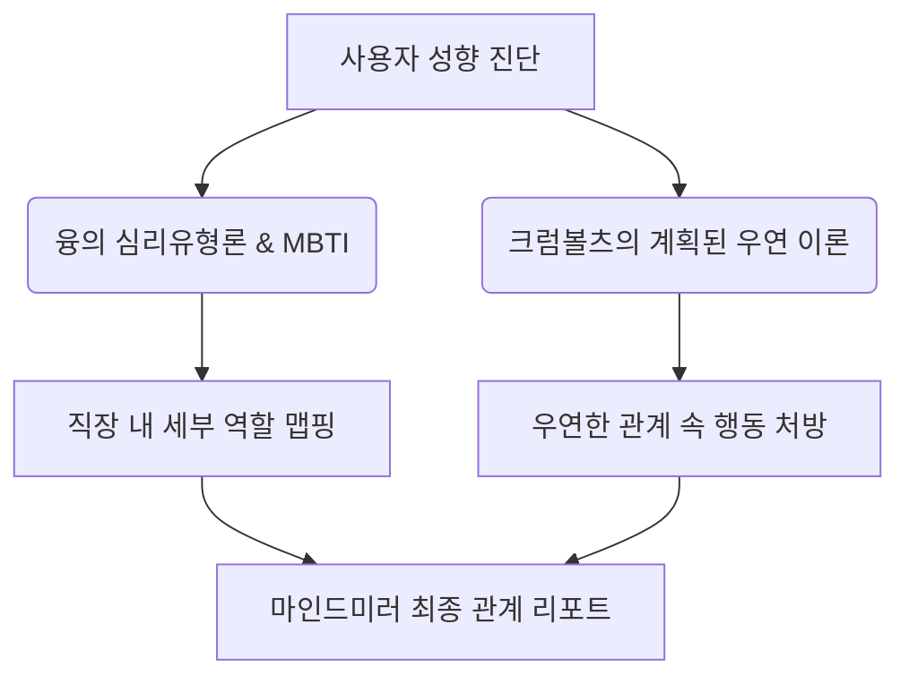

# 작성일: 2026년 6월 7일
# 작성자: DD.nim 제휴영업팀장

안녕하세요, **DD.nim**입니다. 

우리 팀이 준비하고 있는 직장인 성격 진단 및 케미 매칭 서비스인 `마인드미러(mind-mirror)`의 개선 기획과 이에 대한 심리학적/조직행동학적 배경 이론을 정리한 분석 보고서입니다. 비개발자 동료들도 이 서비스가 왜 과학적이고 신뢰할 수 있는지 쉽게 이해할 수 있도록 구성했습니다.

---

## 1. 서비스 개편 방향 요약

본 개편은 기존의 일방향성 진단에서 탈피하여, **소셜 공유(Viral)를 통한 다자간 관계 네트워크**를 구축하는 것을 목표로 합니다.

| 개편 항목 | 기존 서비스 (오피스 유니버스) | 신규 서비스 (마인드미러) |
| :--- | :--- | :--- |
| **핵심 컨셉** | 개인의 일일 직장 생존 유형 진단 및 단순 매칭 | 개인 진단 + 공유를 통한 동료와의 관계도 시각화 |
| **프로필 정보** | 직책, 나이, 성별, 띠(수동 선택), 기분 | 이름, 생년월일(**띠 자동 계산**), 직책 |
| **결과물 제공** | 16가지 유형 카드 및 조심할 행동 제안 | 성격 비율 그래프, 심층 역할 분석, 이론적 근거 제시 |
| **관계 매칭** | 가입자 데이터 풀에서 최고 점수자 1명 매칭 | **공유 링크 기반 1:1 관계 분석 및 전체 인적 관계도** |

---

## 2. 마인드미러의 이론적 배경 및 신뢰성 근거

본 서비스에서 제공하는 분석 결과가 단순한 심리 테스트나 바넘 효과[^1]에 의존하는 놀이에 그치지 않도록, 검증된 학술 이론과 논문을 기반으로 진단 로직을 설계했습니다.

### 2.1. 성향 진단의 과학적 기반
- **칼 융(Carl Jung)의 심리유형론(Psychological Types)**: 인간의 인지와 판단 방식을 외향/내향(E/I), 감각/직관(S/N), 사고/감정(T/F)의 대극으로 분류한 이론입니다. 본 진단은 이 대극 이론에 기반하여 직장 내 의사결정 스타일을 도출합니다.
- **MBTI(Myers-Briggs Type Indicator)의 직무 적합도 연구**: 성격 유형과 직무 만족도 간의 상관관계를 다룬 수많은 산업심리학 논문[^2]에 근거하여, 각 유형이 조직 내에서 수행하는 핵심 역할(예: 전략가, 중재자, 촉진자 등)을 재미있고 직관적으로 재정의했습니다.

### 2.2. 계획된 우연 이론 (Planned Happenstance Theory)
- **존 크럼볼츠(John Krumboltz) 교수**의 진로 발달 이론입니다. 커리어의 성공 중 80%는 계획되지 않은 '우연한 사건'에서 비롯되며, 이를 긍정적인 기회로 전환하기 위해 5가지 태도(**호기심, 인내성, 유연성, 낙관성, 위험 감수**)가 필요하다고 봅니다.
- **마인드미러의 접목**: 동료와의 갑작스러운 갈등이나 예상치 못한 협업 요청(우연적 사건)을 맞닥뜨렸을 때, 자신의 성격 성향에 맞춰 어떤 태도를 취해야 시너지를 낼 수 있는지 구체적인 행동 처방 가이드를 제공합니다.

> [!info] **계획된 우연 이론의 5대 핵심 요인**
> 1. **호기심 (Curiosity)**: 새로운 학습 기회를 탐색함
> 2. **인내성 (Persistence)**: 좌절에도 불구하고 노력을 지속함
> 3. **유연성 (Flexibility)**: 태도와 상황을 긍정적으로 변화시킴
> 4. **낙관성 (Optimism)**: 새로운 기회를 긍정적으로 바라봄
> 5. **위험 감수 (Risk Taking)**: 결과가 불확실해도 행동을 취함

---

## 3. 관계 매칭 및 위트 있는 영향력 유형 설계

공유된 링크를 통해 상대방이 응답했을 때, 두 사람의 성격 조화를 분석하여 오늘 하루 서로에게 미치는 영향력을 위트 있게 표현합니다.

### 3.1. 영향력 유형 분류 표

| 영향력 유형 | 성격 궁합 조건 | 매칭 컨셉 및 위트 있는 조언 |
| :--- | :--- | :--- |
| **오늘의 구원자 👼** | 궁합 점수 90점 이상 | 회의실에서 내 편이 되어 기막힌 실드를 쳐줄 은인. 커피 조공 추천! |
| **당신을 피해야 해 ☠️** | 궁합 점수 50점 이하 | 사소한 눈빛 교환도 스파크로 번질 수 있음. 메신저 답장은 3분 늦게! |
| **야근 동반자 ☕** | P/J 점수 차가 극명하거나 번아웃 수준이 비슷할 때 | 둘이 뭉치면 없던 일도 창조됨. 함께 퇴근 송을 들으며 칼퇴를 모색하세요. |
| **아이디어 부스터 🚀** | 양쪽 모두 직관(N) 성향 강함 | 대화 한 번에 엉뚱하지만 대박 기획이 튀어나오는 창조적 브레인 조합. |
| **감정 충전기 🔋** | 양쪽 모두 감정(F) 성향 강함 | 지친 유리 멘탈을 따뜻한 리액션으로 100% 충전해 줄 힐링 요정. |
| **팩트 폭격기 🎯** | 양쪽 모두 사고(T) 성향 강함 | 뼈 때리는 논리로 오탈자와 논리 오류를 완벽 진압해 줄 인간 교정기. |

> [!tip] **마인드미러의 매력 포인트**
> 호스트와 게스트의 1:1 관계 분석은 단순히 점수로만 끝나지 않고, 캐릭터 간의 인터랙티브 연결선과 재미있는 타이틀을 보여주어 자발적인 캡처 및 SNS 공유를 유도합니다.

---

## 4. 마치며

이번 개편을 통해 `마인드미러`는 단순한 심리 진단 도구를 넘어, **직장 내 건강한 소통과 관계 형성을 돕는 가벼운 네트워킹 플랫폼**으로 진화할 것입니다. 신뢰성 높은 이론적 기반 위에 위트와 게이미피케이션을 얹어, 비개발자 직장인들도 큰 진입장벽 없이 즐길 수 있는 프리미엄 서비스를 완성하겠습니다.

다음 글에서는 실제 구현된 UI 디자인과 차트 시각화 요소에 대해 공유해 드리겠습니다. 감사합니다.

---
[^1]: **바넘 효과 (Barnum Effect)**: 사람들이 보편적으로 가진 성격 특성을 자신만의 독특한 특성으로 믿는 심리적 현상. 본 서비스는 개인화된 변수(띠, 직책)를 조합하여 이를 통제합니다.
[^2]: **참고 문헌**: Myers, I. B. (1980). *Gifts Differing: Understanding Personality Type*. Davies-Black Publishing.
