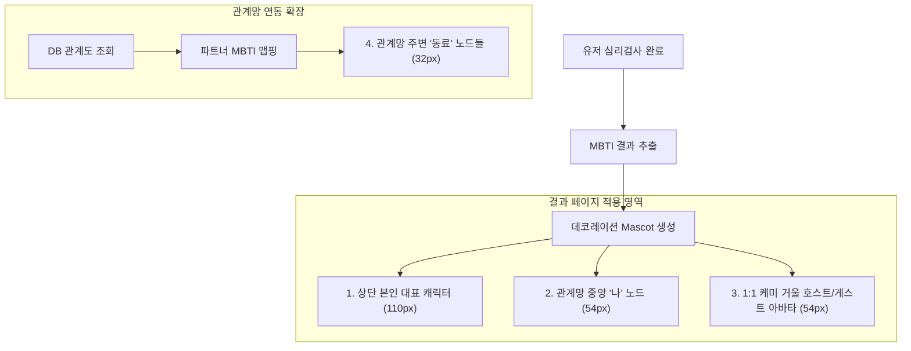

작성일: 2026-06-07
작성자: DD.nim (제휴영업팀장)

안녕하세요, **DD.nim**입니다.

이전의 초대링크 동기화 오류 해결에 이어, 이번에는 우리 서비스의 비주얼을 한 단계 진화시키기 위해 **심리분석 결과(MBTI)에 따른 맞춤형 캐릭터 데코레이션 및 관계망 이식 작업**을 완수하였습니다.

이것이 단순한 텍스트 기반 결과창에서 벗어나, 어떻게 유저들에게 시각적 즐거움을 선사하고 바이럴 효과를 극대화할 수 있는지 그 분석 결과를 정리하여 공유해 드립니다.

---

## 1. 개요 및 목적

마인드미러는 그동안 뛰어난 심리 분석 로직에도 불구하고, 결과 페이지와 관계망에 획일화된 기본 아바타(`👤`, `✨`)만을 사용해 와서 시각적 단조로움이 지적되었습니다. 이에 사용자가 획득한 MBTI 유형에 기반하여 자동으로 캐릭터의 외양(모자, 안경, 콧수염 등)이 변경되도록 시스템을 설계하고, 이를 관계망에 입혀 **세련되고 생동감 넘치는 시각화**를 이끌어내는 것을 목적으로 삼았습니다.

---

## 2. 캐릭터 다이내믹 데코레이션 설계

캐릭터의 본체인 곰돌이 얼굴형태는 친근한 브랜딩 유지를 위해 그대로 두되, 성향 조합에 맞춰 다채로운 CSS 소품을 입체적으로 가미했습니다.

### 2.1. 성향 조합별 소품 데코레이션 규칙

각 성격 유형의 특성에 맞게 재미있는 규칙으로 모자와 소품을 배정했습니다.

| 성향 조합 | 획득 소품 (영문명) | 비주얼적 의미 및 효과 |
| :--- | :--- | :--- |
| **E (외향) + P (인식)** | 🎉 고깔 파티모자 (`party`) | 사교적이고 즉흥적인 에너지를 대변하는 발랄한 연출 |
| **E (외향) + J (판단)** | 👑 황금 왕관 (`crown`) | 조직 내에서 리더십을 발휘하고 목표지향적인 이미지 부각 |
| **I (내향) + P (인식)** | 🎨 화가 베레모 (`beret`) | 조용하지만 자신만의 독창적인 예술성을 표출하는 느낌 연출 |
| **I (내향) + J (판단)** | 🧢 딥워크 비니 (`beanie`) | 묵묵하고 차분하게 업무에 고도로 집중(Deep Work)하는 지적인 모습 |
| **T (사고형) 포함** | 👓 인텔리 안경 (`glasses`) | 논리적이고 객관적인 사고에 초점을 맞춘 둥근 테 안경 |
| **J (판단) & S/T (이성/감각)** | 🧔 젠틀맨 콧수염 (`moustache`) | 계획적이고 정교한 일처리를 보여주는 신뢰감 넘치는 수염 데코 |

---

## 3. 결과 페이지 및 관계망 전격 이식

새로이 구현한 다이내믹 Mascot 컴포넌트를 서비스의 핵심 지점인 **결과 분석 페이지**와 **마인드미러 관계망**에 긴밀하게 통합하였습니다.

### 3.1. 화면 레이아웃 및 CSS 최적화

축소 렌더링 시 아바타 위치가 비뚤어지지 않도록, 스타일 구조를 리터칭하여 레이아웃 안정성을 공고히 했습니다.

> [!tip] 레이아웃 정렬을 위한 팁
> - Mascot 컴포넌트는 `scale` 방식으로 크기를 가변하기 때문에, 부모 노드의 정렬 구조가 깨지기 쉽습니다.
> - 이를 막기 위해 노드 컨테이너인 `.node-avatar`, `.guest-node-zodiac`, `.avatar-circle` 등에 `overflow: visible;` 및 `display: flex; justify-content: center; align-items: center;`를 입혀 가상 바운딩 박스를 유연하게 처리함으로써 완벽한 정렬을 유지시켰습니다.

> [!warning] 데이터 모델 상호작용 주의점
> - 1:1 매칭 뷰(게스트 전용)에서 호스트와 게스트의 비주얼 캐릭터가 완벽하게 그려지도록, 기존 API(`api/test/submit/route.js`) 전송단에 `hostMbti`와 `guestMbti` 정보를 추가하여 DB와 동기화시켰습니다.

---

## 4. 마치며

로컬 환경에서 Next.js의 최종 프로덕션 빌드 명령어(`npm run build`) 검증을 마쳤으며, 어떠한 오류나 경고 없이 컴파일에 성공하였습니다. 

이번 비주얼 패치 덕분에 직장인들이 검사 결과를 완료한 직후 화면에 노출되는 나만의 귀여운 안경 쓴 왕관 곰돌이, 혹은 비니 쓴 콧수염 곰돌이 캐릭터를 보며 성격 유형을 한눈에 식별할 수 있게 되었습니다. 나아가, 나와 엮인 동료들이 하나씩 늘어날 때마다 관계망 지도(Relation Map)에 알록달록한 성격 캐릭터들이 옹기종기 모여드는 장관이 연출되어 서비스의 가치와 재미가 대폭 배가될 것입니다.

다음 보고서에서는 **관계망에서 각 연결선(지그재그선, 물결선 등)의 애니메이션 효과와 노드 인터랙션을 강화하여 손맛이 느껴지는 모바일 반응형 터치 가이드**로 찾아뵙겠습니다. 감사합니다!
